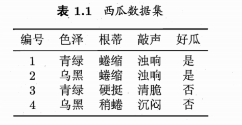
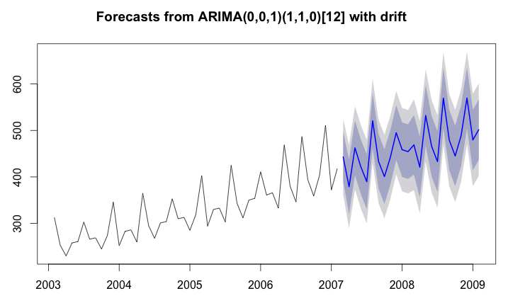
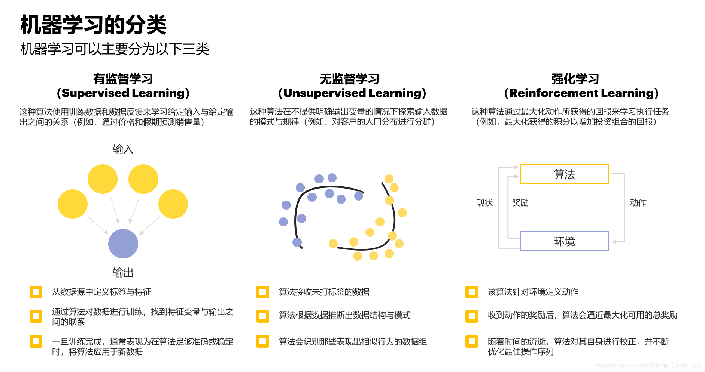
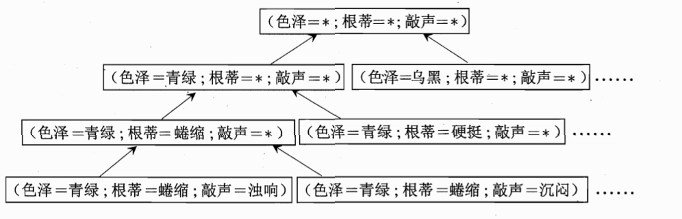
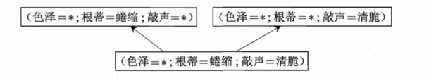
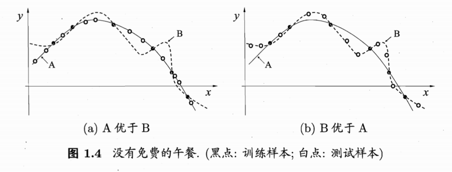
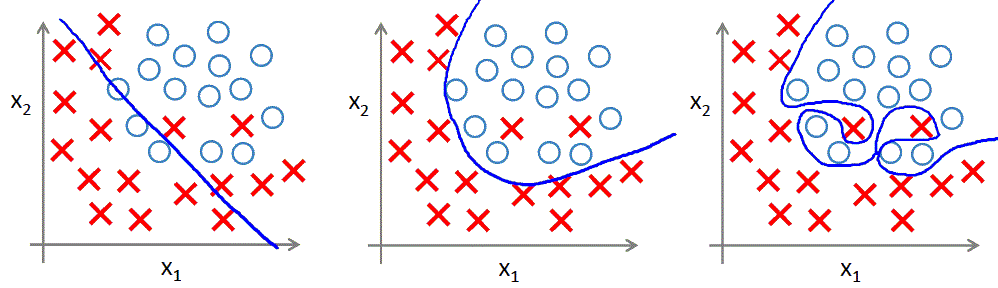
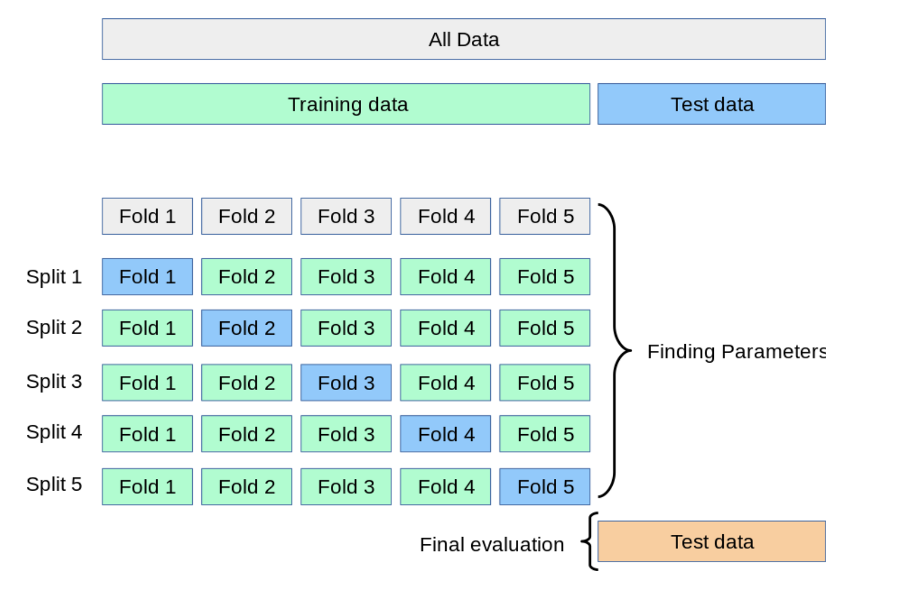

## 第1章 绪论

#### 1. **机器学习概述**
- **定义**：机器学习是通过数据训练模型，使模型能够从数据中学习规律，并用于预测或决策。
- **核心思想**：通过优化算法调整模型参数，使模型的预测结果尽可能接近真实值。

#### 2. **基本术语**
- **样本（Sample）**：也称为“示例”，是对一个事件或对象的描述，通常用向量表示。例如，西瓜的样本可以用色泽、根蒂、敲声等特征表示。
- **样本空间（Sample Space）**：表示所有可能的样本向量构成的空间，通常用 $\mathcal{X}$示。

- **数据集（Dataset）**：由多个样本组成的集合，通常表示为 $D = \{\boldsymbol{x}_1, \boldsymbol{x}_2, \dots, \boldsymbol{x}_m\}$。
- **模型（Model）**：通过机器学习算法从数据中学得的函数，用于预测或决策。例如，线性回归模型  $y = wx + b$。
- **标记（Label）**：样本的目标值，用于监督学习。例如，西瓜的“好瓜”或“坏瓜”。

- **分类与回归**：

  - **分类**：标记为离散值，如二分类（正类/反类）或多分类，比如垃圾邮件分类，图像分类等。

  

  - **回归**：标记为连续值，如房价预测，时间序列预测。

  

  > 时间序列预测模型有：AR、MA、ARMA、ARIMA模型等等
- **监督学习，无监督学习和强化学习**：

  - **监督学习**：训练时使用标记信息，如分类和回归。

  - **无监督学习**：训练时不使用标记信息，如聚类。
  - **强化学习：**最大化动作所获得回报来学习执行任务

  

#### 3. **泛化能力**
- **定义**：模型对未知数据的预测能力。
- **重要性**：模型的最终目标是泛化，即在未见过的数据上表现良好。

- **数据与算法的关系**：
  - **数据决定模型的上限**：数据量越大、特征工程越好，模型效果越好。
  - **算法逼近上限**：不同算法通过学习数据中的规律，逼近模型的上限。

#### 4. **假设空间与版本空间**
- **假设空间（Hypothesis Space）**：所有可能的模型构成的集合。例如，线性回归的假设空间是所有线性函数的组合。

- **版本空间（Version Space）**：能够拟合训练集的所有模型构成的集合。

#### 5. **归纳偏好**
- **定义**：机器学习算法对某些模型的偏好。例如，**线性回归偏好线性模型，而多项式回归偏好非线性模型**。
- **奥卡姆剃刀原则**：在多个假设与观察一致时，选择**最简单的模型**。
- **模型选择**：通过测试集的表现来评估模型的优劣。
- **NFL定理：**NFL定理，即No Free Lunch Theorem（没有免费的午餐定理），在所有可能的数据分布上，任意两个算法的平均性能是相同的。这意味着，**没有一种算法在所有情况下都是最优的，每个算法都有其适用的场景和局限性**。

#### 6. **公式推导**
- **公式 (1.1)**：
  $
  E_{ote}(\mathfrak{L}_a | X, f) = \sum_{h} \sum_{\boldsymbol{x} \in \mathcal{X}-X} P(\boldsymbol{x}) \mathbb{I}(h(\boldsymbol{x}) \neq f(\boldsymbol{x})) P(h | X, \mathfrak{L}_a)
  $
  - 表示算法 $\mathfrak{L}_a$在数据集 $X$ 上的期望误差。
- **公式 (1.2)**：
  $\sum_{f} E_{ote}(\mathfrak{L}_a | X, f) = 2^{|\mathcal{X}|-1} \sum_{\boldsymbol{x} \in \mathcal{X}-X} P(\boldsymbol{x}) \cdot 1$
  - 推导过程假设 $f$ 服从均匀分布，最终得到期望误差的表达式。

#### 7. **总结**
- **机器学习流程**：数据预处理 → 模型选择 → 模型训练 → 模型评估 → 模型部署。
- **损失函数与优化**：在深度学习以及部分的传统机器学习的模型中，通过最小化损失函数来优化模型参数，常用优化算法包括梯度下降（SGD）和 Adam。
- **模型评估**：使用测试集评估模型的泛化能力，常用指标包括准确率、F1分数、Recall召回率、Acc@n、均方误差等。
- **假设空间与归纳偏好**：不同算法有不同的假设空间和归纳偏好，模型选择应根据具体问题决定。

---

#### 

## 第2章 模型评估与选择

#### 1. **经验误差与过拟合**
- **错误率**：分类错误的样本占总样本的比例，公式为 $E = \frac{a}{m}$，其中$ a $为分类错误的样本数，$m$为总样本数。
- **精度**：分类正确的样本占总样本的比例，公式为$1 - E $。
- **误差**：模型的预测值与真实值之间的差异。
- **经验误差（训练误差）**：模型在训练集上的误差。
- **泛化误差**：模型在新样本上的误差。

- **过拟合**：模型在训练集上表现很好，但在新样本上表现较差，通常是因为模型过于复杂，学习了训练集中的噪声。
- **欠拟合**：模型在训练集和新样本上表现都不好，通常是因为模型过于简单，无法捕捉数据中的规律。

#### 2. **评估方法**
- **留出法**：将数据集划分为训练集和测试集，训练集用于训练模型，测试集用于评估模型性能。真实的比赛情况是给训练集，测试集，然后训练集中间划分一部分作为验证集，保存验证集最佳表现的模型，然后处理测试集上的内容，提交结果

- **交叉验证法**：将数据集划分为多个子集，轮流使用其中一个子集作为测试集，其余子集作为训练集。常用的有 **k 折交叉验证**。

- **自助法**：通过有放回抽样生成训练集，未被抽中的样本作为测试集。适用于小数据集。

#### 3. **性能度量**
- **错误率与精度**：用于分类问题，错误率是分类错误的样本比例，精度是分类正确的样本比例。

- **查准率（Precision）**：模型预测为正例的样本中，真正为正例的比例。

- **查全率（Recall）**：所有正例样本中，被模型预测为正例的比例。

- **F1 分数**：查准率和查全率的调和平均数，公式为：
  $F1 = \frac{2 \times P \times R}{P + R}$
  
- **ROC 曲线与 AUC**：
  - **ROC 曲线**：以假正例率（FPR）为横轴，真正例率（TPR）为纵轴绘制的曲线。
  - **AUC**：ROC 曲线下的面积，AUC 越大，模型性能越好。
  
  

#### 4. **比较检验**
- **假设检验**：用于比较不同模型或算法的性能差异是否显著。
- **t 检验**：用于比较两个模型的平均性能差异。
- **交叉验证 t 检验**：基于交叉验证结果的 t 检验，适用于小数据集。
- **McNemar 检验**：用于比较两个分类器在同一个测试集上的性能差异。

#### 5. **偏差与方差**
- **偏差**：模型的预测值与真实值之间的差异，偏差高通常意味着模型欠拟合。

- **方差**：模型对训练数据中噪声的敏感程度，方差高通常意味着模型过拟合。

- **偏差-方差分解**：模型的泛化误差可以分解为偏差、方差和噪声三部分：
  
  $E(f; D) = \text{偏差}^2 + \text{方差} + \text{噪声}$

#### 6. **关键公式**
- **AUC 计算公式**：
  
  $\text{AUC} = \frac{1}{2} \sum_{i=1}^{m-1} (x_{i+1} - x_i) \cdot (y_i + y_{i+1})$
  
- **F1 分数公式**：
  $F1 = \frac{2 \times P \times R}{P + R}$
  
- **偏差-方差分解公式**：
  $E(f; D) = \mathbb{E}_D \left[ (f(x; D) - y_D)^2 \right] = \text{偏差}^2 + \text{方差} + \text{噪声}$

#### 7. **总结**
- **模型评估**：通过错误率、精度、查准率、查全率、F1 分数、ROC 曲线和 AUC 等指标评估模型性能。
- **模型选择**：通过交叉验证、留出法等方法选择最优模型。
- **偏差与方差**：理解模型的偏差和方差有助于诊断模型的欠拟合和过拟合问题。
- **比较检验**：通过假设检验等方法比较不同模型的性能差异是否显著。
