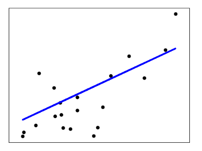
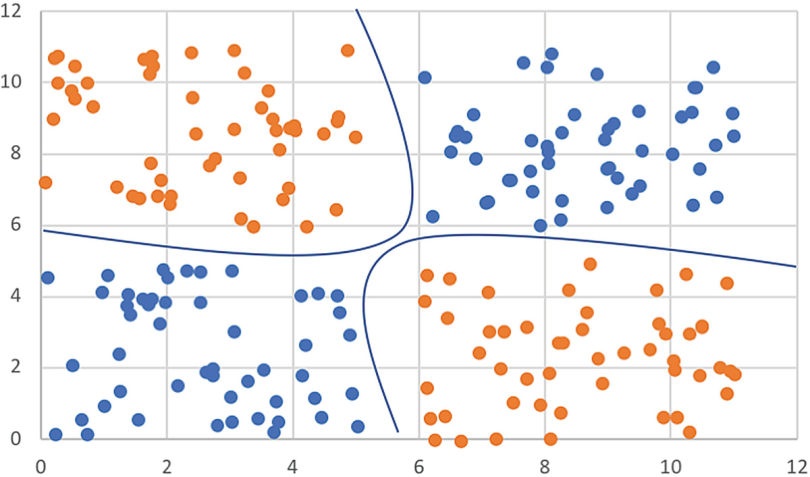
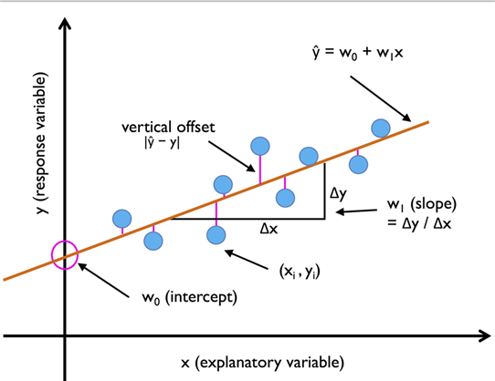
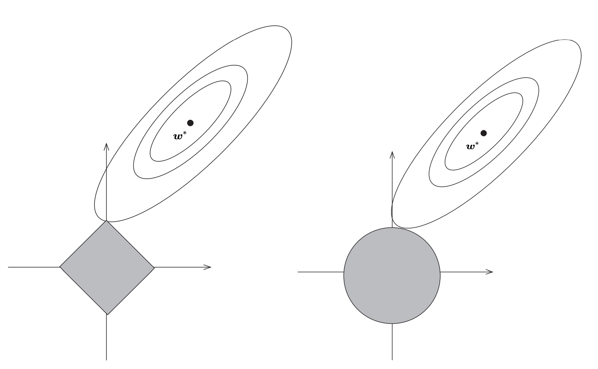

# 第三章 

### 第3章 线性模型 总结笔记

#### 0. 皮尔逊系数

**皮尔逊相关系数（Pearson Correlation Coefficient）** 是衡量两个变量之间**线性关系强度和方向的统计量**。它的取值范围在 -1 到 1 之间：

- **1** 表示完全正线性相关。
- **-1** 表示完全负线性相关。
- **0** 表示无线性相关。

皮尔逊相关系数的计算公式如下：

$$
r = \frac{\text{Cov}(X, Y)}{\sigma_X \sigma_Y}
$$

其中：
- $ \text{Cov}(X, Y) $ 是变量 \( X \) 和 \( Y \) 的协方差。
- $ \sigma_X $ 是变量 \( X \) 的标准差。
- $ \sigma_Y $ 是变量 \( Y \) 的标准差。


皮尔逊相关系数可以进一步展开为：

$$
r = \frac{\sum_{i=1}^n (x_i - \bar{x})(y_i - \bar{y})}{\sqrt{\sum_{i=1}^n (x_i - \bar{x})^2} \sqrt{\sum_{i=1}^n (y_i - \bar{y})^2}}
$$

其中：
- $x_i $和 $ y_i$ 分别是第 $i$个样本的$X$和$Y$ 值。
- $\bar{x}$ 和 $ \bar{y} $ 分别是 $X$和 $Y$ 的均值。
- $n $ 是样本数量。

**分子**：
$$
\sum_{i=1}^n (x_i - \bar{x})(y_i - \bar{y})
$$
- 表示 $X$ 和 $Y$ 的协方差，衡量$X$和$Y$的变化趋势是否一致。
- **正相关**：如果$X$和 $Y$ 同时高于或低于均值，分子为正。
- **负相关**：如果 $X$和$Y$ 的变化方向相反，分子为负。

**分母**：
$$
\sqrt{\sum_{i=1}^n (x_i - \bar{x})^2} \sqrt{\sum_{i=1}^n (y_i - \bar{y})^2}
$$
- 是 $X$和$Y$ 的标准差的乘积。
- 用于标准化协方差，使得相关系数的取值范围在 -1 到 1 之间。


#### 1. **线性模型概述**

- **线性模型**是机器学习中最基础的模型，许多复杂模型（如支持向量机、神经网络）都可以看作是线性模型的扩展。

  - 公式核心：$\min_{w,b} \sum_{i=1}^n (y_i - w^T x_i - b)^2$
  - 应用场景：房价预测、销量趋势、二手车价格预测等分析需量化解释变量影响的回归任务
  - 正则化变体：**岭回归（Ridge Regression）、Lasso回归（Lasso Regression）、弹性网络回归（Elastic Net）等**

  

- **线性回归**和**逻辑回归**分别用于回归和分类任务，是本章的重点内容。

  - 公式核心：$P(y=1|x) = \frac{1}{1 + e^{-(w^T x + b)}}$
  - 应用场景：广告点击率预测、信用风险评估、金融产品订购、基于音频统计特征的健康/抑郁语音分类等概率型分类任务。

  

- **线性判别分析**虽然不常用，但其核心思想与主成分分析（PCA）相似，属于监督降维方法。

| **模型**     | **核心特点**                           | **典型应用**                         |
| ------------ | -------------------------------------- | ------------------------------------ |
| 线性回归     | 连续响应变量，特征与目标线性关系明确   | 经济指标预测、工程参数拟合           |
| 岭回归       | 高维数据共线性严重，需稳定解           | 金融风险模型、图像处理               |
| Lasso回归    | 特征维度极高，需自动化特征选择         | 文本分类、生物信息学特征筛选         |
| 弹性网络     | 兼顾特征选择与模型稳定性               | 基因组数据建模、推荐系统特征工程     |
| 逻辑回归     | 概率输出，解释性强                     | 医疗诊断、客户流失预测               |
| 多项式回归   | 低维非线性关系建模                     | 物理实验曲线拟合、生态学趋势分析     |
| 广义线性模型 | 非正态分布响应变量（计数、二元、连续） | 保险索赔次数预测、流行病学发病率建模 |


#### 2. **线性回归**




- **目标**：通过最小化预测值与真实值之间的误差，找到最佳的线性模型参数。

- **损失函数**：均方误差（MSE），公式为：$E(w, b) = \sum_{i=1}^{m} (y_i - wx_i - b)^2$
  
- **误差分布**：
  
- **闭式解**：通过求导并令导数为零，可以得到参数的闭式解：

  $w = \frac{\sum_{i=1}^{m} y_i (x_i - \bar{x})}{\sum_{i=1}^{m} x_i^2 - \frac{1}{m} (\sum_{i=1}^{m} x_i)^2}$

- **多元线性回归**：当输入特征为多维时，线性回归可以推广为多元线性回归，公式为：
  $
  y = w^T x + b
  $
  
- **矩阵形式**：多元线性回归的闭式解可以通过矩阵运算得到：
  $
  \hat{w} = (X^T X)^{-1} X^T y
  $
  
- **代码形式**：

  ```python
  class LinearRegression(MultiOutputMixin, RegressorMixin, LinearModel):
      """
      相关说明
      """
  
      _parameter_constraints: dict = {
          "fit_intercept": ["boolean"],
          "copy_X": ["boolean"],
          "n_jobs": [None, Integral],
          "positive": ["boolean"],
      }
  
      def __init__(
          self,
          *,
          fit_intercept=True, # 是否需要截距，西瓜书上给的多元线性回归是需要的
          copy_X=True,
          n_jobs=None,
          positive=False,
      ):
          self.fit_intercept = fit_intercept
          self.copy_X = copy_X
          self.n_jobs = n_jobs
          self.positive = positive
  ```


#### 2.1 线性回归的其他变体

为提升模型泛化能力，引入正则化技术控制模型复杂度：



> Fig.1[1] Lasso (left) and ridge (right) regression.


##### **2.1.1 岭回归（Ridge Regression）**

- **正则化方法**：在损失函数中增加L2范数惩罚项，约束权重向量的欧氏长度。
  $
  \min_{w,b} \sum_{i=1}^n (y_i - w^T x_i - b)^2 + \lambda \|w\|_2^2
  $
- **公式说明**：
  - $y_i $：第$i$个样本的真实值。
  - $ w $：权重向量（模型的系数）。
  - $x_i $：第 $i$ 个样本的特征向量。
  - $ b $：偏置项（截距）。
  - $\lambda $：正则化强度（超参数），控制正则化项的影响。
  - $\|w\|_2^2 $：权重向量的L2范数（欧氏长度）的平方，即 $ w_1^2 + w_2^2 + \dots + w_p^2 $。
- **作用**：缓解多重共线性，防止过拟合，适用于特征高度相关的场景，高度相关的自变量特征可以使用皮尔逊系数进行筛选。
- **代码形式**：

```python
class Ridge(MultiOutputMixin, RegressorMixin, _BaseRidge):
    """Linear least squares with l2 regularization.
	代码说明
    """

    def __init__(
        self,
        alpha=1.0, # alpha就是上面笔记公式上的lambda
        *,
        fit_intercept=True,
        copy_X=True,
        max_iter=None,
        tol=1e-4,
        solver="auto",
        positive=False,
        random_state=None,
    ):
        super().__init__(
            alpha=alpha,
            fit_intercept=fit_intercept,
            copy_X=copy_X,
            max_iter=max_iter,
            tol=tol,
            solver=solver,
            positive=positive,
            random_state=random_state,
        )
```

- **`alpha`**：正则化强度（即公式中的 $\lambda$）。

  - 值越大，正则化效果越强，权重向量越小。
  - 值越小，正则化效果越弱，模型越接近普通最小二乘法。

- **`fit_intercept`**：是否计算截距项 \( b \)。

- **`copy_X`**：是否复制特征矩阵 \( X \)。

- **`max_iter`**：求解器的最大迭代次数。

- **`tol`**：求解器的收敛精度。

- **`solver`**：求解优化问题的算法，思路是使用优化算法对$w$进行优化，使得目标函数达到最小化：

  $$ \min_{w,b} \sum_{i=1}^n (y_i - w^T x_i - b)^2 + \lambda \|w\|_2^2 $$

  尽量达到收敛值阈值之下**`tol`**，或者是达到最大迭代次数**`max_iter`**

  求解优化器有很多类型，如 **`svd`（奇异值分解）**、**`cholesky`（Cholesky 分解）**、**`lsqr`（最小二乘法）**、**`sparse_cg`（共轭梯度法）**、 **`sag`（随机平均梯度下降）**、 **`saga`（随机平均梯度下降的改进版）**等。

  - **直接求解方法**：
    - `svd`：使用奇异值分解（SVD）直接求解，小规模数据集。
    - `cholesky`：使用 Cholesky 分解直接求解，小规模数据集。
  - **迭代求解方法**：
    - `lsqr`：使用最小二乘法进行迭代优化，中等规模数据集。
    - `sparse_cg`：使用共轭梯度法进行迭代优化，稀疏数据集。
    - `sag`：使用随机平均梯度下降法进行迭代优化，大规模数据集。
    - `saga`：`sag` 的改进版本，支持更多正则化选项，大规模数据集。

- **`positive`**：是否强制权重为正。

- **`random_state`**：随机种子，用于可重复性。


##### 2.1.1 额外补充 数据集界限划分

- **小规模数据集**：
  - Iris 数据集（150 个样本，4 个特征）。
  - Boston Housing 数据集（506 个样本，13 个特征）。
- **中规模数据集**：
  - MNIST 数据集（70,000 个样本，784 个特征）。
  - CIFAR-10 数据集（60,000 个样本，3,072 个特征）。
- **大规模数据集**：
  - ImageNet 数据集（超过 1,000,000 张图像）。
  - 互联网广告点击率预测数据集（数亿条记录）。


**2.1.2 Lasso回归（Lasso Regression）**

- **正则化方法**：采用L1范数惩罚项，推动部分特征权重归零。
  $
  \min_{w,b} \sum_{i=1}^n (y_i - w^T x_i - b)^2 + \lambda \|w\|_1
  $
- **作用**：自动执行特征选择，生成稀疏解。
- **代码形式**：

```python
class Lasso(ElasticNet):
    """Linear Model trained with L1 prior as regularizer (aka the Lasso).
	代码说明
    """

    _parameter_constraints: dict = {
        **ElasticNet._parameter_constraints,
    }
    _parameter_constraints.pop("l1_ratio")

    path = staticmethod(enet_path)

    def __init__(
        self,
        alpha=1.0,
        *,
        fit_intercept=True,
        precompute=False,
        copy_X=True,
        max_iter=1000,
        tol=1e-4,
        warm_start=False,
        positive=False,
        random_state=None,
        selection="cyclic",
    ):
        super().__init__(
            alpha=alpha,
            l1_ratio=1.0,
            fit_intercept=fit_intercept,
            precompute=precompute,
            copy_X=copy_X,
            max_iter=max_iter,
            tol=tol,
            warm_start=warm_start,
            positive=positive,
            random_state=random_state,
            selection=selection,
        )
```

和上面之前类似，不同的是**`precompute`**表示是否预先计算$X^TX$，**`warm_start`** 是否使用前一次拟合的结果作为初始化。如果为 `True`，可以加速连续拟合；以及**`selection`**按顺序依次"**`cyclic`**"更新权重或者是随机"**`random`**"选择权重进行更新，注意，这里的**`Lasso类`**的父类是下方的**`ElasticNet类`**


**2.1.3 弹性网络回归（Elastic Net）**

- **正则化方法**：结合L1与L2惩罚项，平衡特征选择与权重平滑。
  $
  \min_{w,b} \sum_{i=1}^n (y_i - w^T x_i - b)^2 + \lambda_1 \|w\|_1 + \lambda_2 \|w\|_2^2
  $
- **优势**：在特征数量远大于样本量时，表现优于单一正则化方法。

- **代码形式**：

```python
class ElasticNet(MultiOutputMixin, RegressorMixin, LinearModel):
    """Linear regression with combined L1 and L2 priors as regularizer.
    代码说明
    """

    _parameter_constraints: dict = {
        "alpha": [Interval(Real, 0, None, closed="left")],
        "l1_ratio": [Interval(Real, 0, 1, closed="both")],
        "fit_intercept": ["boolean"],
        "precompute": ["boolean", "array-like"],
        "max_iter": [Interval(Integral, 1, None, closed="left"), None],
        "copy_X": ["boolean"],
        "tol": [Interval(Real, 0, None, closed="left")],
        "warm_start": ["boolean"],
        "positive": ["boolean"],
        "random_state": ["random_state"],
        "selection": [StrOptions({"cyclic", "random"})],
    }

    path = staticmethod(enet_path)

    def __init__(
        self,
        alpha=1.0,
        *,
        l1_ratio=0.5,
        fit_intercept=True,
        precompute=False,
        max_iter=1000,
        copy_X=True,
        tol=1e-4,
        warm_start=False,
        positive=False,
        random_state=None,
        selection="cyclic",
    ):
        self.alpha = alpha
        self.l1_ratio = l1_ratio
        self.fit_intercept = fit_intercept
        self.precompute = precompute
        self.max_iter = max_iter
        self.copy_X = copy_X
        self.tol = tol
        self.warm_start = warm_start
        self.positive = positive
        self.random_state = random_state
        self.selection = selection
```

成员变量作用和上面**`Lasso`**类一样


---

#### 3. **对数几率回归（Logistic Regression）**
- **目标**：用于二分类问题，通过Sigmoid函数将线性模型的输出映射到[0, 1]区间，表示概率。
- **Sigmoid函数**：
  $
  y = \frac{1}{1 + e^{-(w^T x + b)}}
  $
- **损失函数**：对数似然函数，公式为：
  $
  \ell(w, b) = \sum_{i=1}^{m} \left( y_i \ln p_1(x_i) + (1 - y_i) \ln p_0(x_i) \right)
  $
- **优化方法**：由于对数几率回归没有闭式解，通常使用**梯度下降法**或**牛顿法**进行优化。

---

#### 4. **线性判别分析（LDA）**
- **目标**：通过投影将不同类别的样本分开，最大化类间距离，最小化类内距离。
- **优化目标**：$J = \frac{w^T S_b w}{w^T S_w w}$
  其中，\( S_b \) 是类间散度矩阵，\( S_w \) 是类内散度矩阵。
- **闭式解**：通过求解广义特征值问题，得到投影方向：
  $
  S_b w = \lambda S_w w
  $
- **多分类问题**：LDA可以推广到多分类问题，通过求解多个广义特征值来得到多个投影方向。

---

#### 5. **多分类学习**
- **常见方法**：
  - **一对一（OvO）**：将多分类问题分解为多个二分类问题，每两个类别训练一个分类器。
  - **一对多（OvR）**：将一个类别作为正类，其余类别作为负类，训练多个分类器。
  - **多对多（MvM）**：通过编码矩阵将多分类问题转化为多个二分类问题。

---

#### 6. **类别不平衡问题**
- **问题描述**：当数据集中某些类别的样本数量远多于其他类别时，传统的精度指标可能无法准确反映模型性能。
- **解决方法**：
  - **重采样**：对少数类进行过采样，或对多数类进行欠采样。
  - **阈值移动**：调整分类阈值，使得模型更倾向于预测少数类。
  - **代价敏感学习**：为不同类别的错误分类赋予不同的代价。

---

#### 7. **关键公式总结**
- **线性回归闭式解**：
  \[
  w = \frac{\sum_{i=1}^{m} y_i (x_i - \bar{x})}{\sum_{i=1}^{m} x_i^2 - \frac{1}{m} (\sum_{i=1}^{m} x_i)^2}
  \]
- **多元线性回归闭式解**：
  \[
  \hat{w} = (X^T X)^{-1} X^T y
  \]
- **对数几率回归损失函数**：
  \[
  \ell(w, b) = \sum_{i=1}^{m} \left( y_i \ln p_1(x_i) + (1 - y_i) \ln p_0(x_i) \right)
  \]
- **LDA优化目标**：
  \[
  J = \frac{w^T S_b w}{w^T S_w w}
  \]

---

#### 8. **总结**
- **线性模型**是机器学习的基础，广泛应用于回归和分类任务。
- **线性回归**通过最小化均方误差来拟合数据，适用于回归问题。
- **对数几率回归**通过Sigmoid函数将线性模型的输出映射为概率，适用于二分类问题。
- **线性判别分析**通过最大化类间距离和最小化类内距离来进行降维和分类。
- **多分类学习**可以通过一对一、一对多或多对多的方法进行处理。
- **类别不平衡问题**需要通过重采样、阈值移动或代价敏感学习来解决。

通过本章的学习，读者应掌握线性模型的基本原理和应用场景，能够使用线性回归、对数几率回归和线性判别分析解决实际问题。


---

### **XGBoost、LightGBM 与线性回归的关系**

#### **1. 基学习器的选择与模型结构**
**1.1 基学习器的类型**  
- **线性回归**：直接使用线性模型 $y = w^T x + b $进行预测，通过最小化均方误差（MSE）优化参数。  
- **XGBoost/LightGBM**：默认使用 **决策树** 作为基学习器（弱学习器），通过集成多个树模型提升预测能力。  
  - **关键扩展**：XGBoost 和 LightGBM 支持 **自定义基学习器**，例如将线性回归作为基模型，构建 **线性提升模型**（Linear Boosting）。  
  - **示例**：在 XGBoost 中设置 `booster='gblinear'`，使用线性模型替代树模型进行梯度提升。

**1.2 线性提升模型的结构**  

- **模型形式**：  
  $\hat{y}_i = \sum_{k=1}^K f_k(x_i), \quad f_k \in \mathcal{F} $ 
  - 其中 $\mathcal{F} $为基学习器集合。当基学习器为线性模型时，$f_k(x) = w_k^T x + b_k $。  
- **优化目标**：  
  $
  \text{Obj} = \sum_{i=1}^n L(y_i, \hat{y}_i) + \sum_{k=1}^K \Omega(f_k)  
  $
  - $ L $ 为损失函数（如 MSE），$\Omega(f_k) = \alpha \|w_k\|_1 + \beta \|w_k\|_2^2 $ 为正则化项。

---

#### **2. 损失函数与优化方法对比**
**2.1 损失函数设计**  

- **线性回归**：  
  \[
  L(w, b) = \sum_{i=1}^n (y_i - w^T x_i - b)^2  
  \]
  - 闭式解通过最小二乘法直接求解 \( w = (X^T X)^{-1} X^T y \)。  
- **XGBoost/LightGBM**：  
  - 使用 **梯度提升框架**，通过迭代优化损失函数。  
  - 对于回归任务，损失函数同样可以是 MSE，但优化方式不同：  
    \[
    L(\theta) = \sum_{i=1}^n (y_i - \hat{y}_i^{(t-1)} - f_t(x_i))^2 + \Omega(f_t)  
    \]
    - 其中 \( \hat{y}_i^{(t-1)} \) 是前 \( t-1 \) 轮的预测值，\( f_t \) 是第 \( t \) 轮的基学习器。

**2.2 优化过程对比**  
| **方法**         | **优化策略**                             | **特点**                                       |
| ---------------- | ---------------------------------------- | ---------------------------------------------- |
| 线性回归         | 解析解（闭式解）                         | 计算高效，但无法处理非线性关系。               |
| XGBoost/LightGBM | 梯度下降（一阶导数）或牛顿法（二阶导数） | 支持复杂目标函数和正则化，适合高维非线性数据。 |

#### **3. 正则化与模型复杂度控制**
**3.1 正则化方法**  
- **线性回归**：  
  - **L2 正则化（岭回归）**：  
    \[
    L(w) = \sum_{i=1}^n (y_i - w^T x_i)^2 + \lambda \|w\|_2^2  
    \]
  - **L1 正则化（Lasso）**：  
    \[
    L(w) = \sum_{i=1}^n (y_i - w^T x_i)^2 + \lambda \|w\|_1  
    \]
- **XGBoost/LightGBM**：  
  - 在目标函数中直接引入正则化项：  
    \[
    \Omega(f) = \gamma T + \frac{1}{2} \lambda \|w\|^2 + \alpha \|w\|_1  
    \]
    - \( T \) 为树的叶子节点数（树复杂度），\( \lambda, \alpha \) 控制 L2/L1 正则化强度。  

**3.2 正则化的作用**  
- **线性模型**：防止过拟合，提升模型泛化能力。  
- **提升模型**：控制基学习器的复杂度（如树的深度、叶子节点数）和权重平滑性。

---

#### **4. 特征处理与模型解释性**
**4.1 特征工程的依赖性**  

- **线性回归**：对特征的线性组合敏感，需手动处理非线性关系（如多项式特征、分箱）。  
- **XGBoost/LightGBM**：  
  - 树模型自动处理非线性关系和特征交互，减少特征工程需求。  
  - 若使用线性基学习器，仍需处理特征的非线性变换（与线性回归类似）。  

**4.2 模型解释性对比**  
| **方法**         | **解释性**                                                   |
| ---------------- | ------------------------------------------------------------ |
| 线性回归         | 高。权重直接反映特征重要性，符号表示正负影响。               |
| XGBoost/LightGBM | 中等。通过特征重要性评分（如增益、覆盖度）评估特征贡献，但无法直接解释权重。 |

**4.3 结合线性与非线性优势**  
- **Hybrid 模型**：在 XGBoost/LightGBM 中混合使用树模型和线性模型作为基学习器。  
  - 示例：前几轮使用树模型捕捉非线性关系，后续轮次使用线性模型优化细节。  

---

#### **5. 实际应用场景对比**
**5.1 适用场景**  
- **线性回归**：  
  - 特征与目标呈强线性关系。  
  - 数据维度低，需要高解释性的场景（如金融风控、医学研究）。  
- **XGBoost/LightGBM**：  
  - 高维数据、非线性关系、复杂特征交互（如推荐系统、图像分类）。  
  - 需要自动特征工程和高效处理大规模数据。  

**5.2 性能与效率**  
- **训练速度**：  
  - 线性回归的闭式解计算复杂度为 \( O(n^3) \)，适合中小规模数据。  
  - XGBoost/LightGBM 通过分布式计算和直方图算法优化，支持大规模数据训练。  
- **预测速度**：  
  - 线性回归的预测时间复杂度为 \( O(d) \)（d 为特征数），极快。  
  - 树模型的预测时间随树的数量和深度增加，但 LightGBM 通过 Leaf-wise 生长策略优化效率。  

---

#### **6. 数学公式扩展：XGBoost 中的线性基学习器**
**6.1 目标函数分解**  
在 XGBoost 中使用线性基学习器时，第 \( t \) 轮的目标函数为：  
\[
\text{Obj}^{(t)} = \sum_{i=1}^n L(y_i, \hat{y}_i^{(t-1)} + f_t(x_i)) + \Omega(f_t)  
\]  
- 若 \( f_t(x) = w^T x + b \)，则目标函数可展开为：  
  \[
  \text{Obj}^{(t)} = \sum_{i=1}^n (y_i - \hat{y}_i^{(t-1)} - w^T x_i - b)^2 + \lambda \|w\|_2^2  
  \]  
- 通过梯度下降或牛顿法求解 \( w \) 和 \( b \)。

**6.2 与线性回归的联系**  
- 若仅使用一轮迭代（\( K=1 \)），XGBoost 的线性提升模型退化为岭回归（L2 正则化线性回归）。  
- 多轮迭代时，线性提升模型相当于对残差进行逐步线性拟合，类似于 **前向分步算法**。

---

#### **7. 实战案例：房价预测**
**7.1 数据特性**  
- 特征：房屋面积、卧室数量、地理位置（数值型 + 类别型）。  
- 目标：房价（连续值）。  

**7.2 模型选择**  
- **线性回归**：若特征与房价呈线性关系（如面积与房价正比），优先选择。  
- **XGBoost/LightGBM**：若存在非线性关系（如地理位置对房价的非线性影响），使用树模型或混合模型。  

**7.3 代码示例（XGBoost 线性提升）**  
```python
import xgboost as xgb

# 使用线性基学习器
params = {
    'booster': 'gblinear',  # 线性模型
    'objective': 'reg:squarederror',
    'lambda': 0.1,          # L2 正则化
    'alpha': 0.5            # L1 正则化
}

model = xgb.train(params, dtrain, num_boost_round=100)
```

---

#### **8. 总结：线性模型与提升模型的协同**
- **互补性**：线性模型提供解释性和高效计算，提升模型处理复杂模式。  
- **灵活应用**：  
  - 在特征工程阶段，可用线性模型筛选重要特征，再输入到 XGBoost/LightGBM。  
  - 在集成框架中，混合使用树模型和线性模型，平衡性能与解释性。  
- **技术趋势**：  
  - **广义线性模型 + 提升**：如 GLM（广义线性模型）与 GBDT 结合，用于处理非高斯分布目标（如泊松回归）。  
  - **深度学习融合**：通过神经网络替代线性模型作为基学习器，构建深度提升模型（如 NGBoost）。

