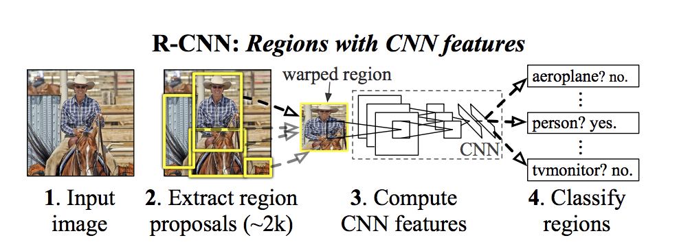
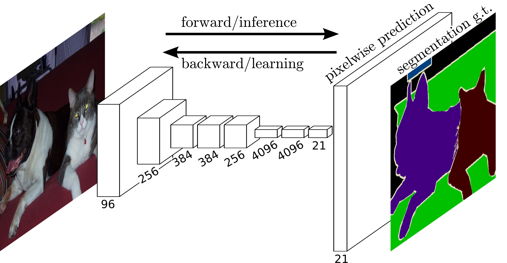

# 1.机器学习的定义

### 传统机器学习概述

机器从海量的数据当中，需要找到自变量数据和因变量数据之间的关联能力，并且根据先前学到的自变量与因变量关联函数之间潜在规律去很好的预测一个未知的自变量去很好预测其对应的因变量，使其具备有"学习"的能力。

例如西瓜分类就需要寻找一个分类效果最优的函数，该函数的输入是西瓜的特征信息，输出是西瓜对应的品种。这个规则函数在函数空间是很多的，比如随机森林算法和决策树算法，对应优化的参数很多，人类难以把它列举出来，因此想通过机器的力量把这个函数自动找出来。

具体来讲，机器学习就是让机器具备找一个**函数**的能力，这个函数由特定的算法组成，比如说是传统机器学习那类算法，机器学习有以下算法

1. 线性回归（Linear Regression）：用于预测连续型数值。
2. 逻辑回归（Logistic Regression）：用于分类问题。
3. 决策树（Decision Tree）：用于分类和回归问题。
4. 随机森林（Random Forest）：用于分类和回归问题。
5. 支持向量机（Support Vector Machine，SVM）：用于分类和回归问题。
6. 朴素贝叶斯（Naive Bayes）：用于分类问题。
7. K近邻算法（K-Nearest Neighbors，KNN）：用于分类和回归问题。
8. 聚类算法（Clustering Algorithm）：用于无监督学习。
9. 降维算法（Dimensionality Reduction Algorithm）：用于数据降维和特征提取。
10. 梯度提升树（Gradient Boosting Tree）：一种集成学习算法，通过迭代地训练多个决策树来提高模型的性能。
11. AdaBoost（Adaptive Boosting）：一种集成学习算法，通过迭代地训练多个弱分类器来提高模型的性能。
12. XGBoost（eXtreme Gradient Boosting）：一种基于梯度提升树的机器学习算法，具有高效性和可扩展性。
13. LightGBM（Light Gradient Boosting Machine）：一种基于梯度提升树的机器学习算法，具有高效性和可扩展性。
14. CatBoost（Categorical Boosting）：一种基于梯度提升树的机器学习算法，专门用于处理分类特征。

> SVM主要用于分类和回归分析，在sklearn库对应的类分别是SVC和SVR。它的基本思想是找到一个最优的超平面，将不同类别的数据点尽可能地分开。

### 深度学习算法概述

深度学习算法通常由工程上堆叠的神经网络基础模块构成，形成深层模型。这些算法主要包括以下几类：

#### 1. **神经网络（Neural Network）**  
神经网络是一种基于神经元的机器学习算法，具有强大的非线性建模能力，是所有神经网络算法的基础。它通过多层神经元堆叠，能够学习复杂的特征表示。

#### 2. **卷积神经网络（Convolutional Neural Network, CNN）**  
CNN 是一种专门用于处理图像和视频数据的神经网络，其核心是通过卷积操作提取局部特征。主要应用包括：  
- **图像分类**：经典模型如 ResNet、DenseNet 等。  

- **目标检测**：如 YOLO、R-CNN 等。  

  

- **图像分割**：如 FCN，UNet等。  

CNN 通过共享权重和局部感受野的设计，相比于先前的单纯的线性层来说，显著降低了参数数量，同时提升了特征提取的效率。

---

#### 3. **循环神经网络（Recurrent Neural Network, RNN）**  
RNN 是一种专门用于处理序列数据的神经网络，能够捕捉时间序列中的依赖关系。其主要应用包括时间序列预测、分类任务和回归任务等。RNN 的变体包括：  
- **LSTM（长短期记忆网络）**：解决了长序列训练中的梯度消失问题。  

- **GRU（门控循环单元）**：简化了 LSTM 的结构，同时保持了较好的性能。  

RNN 及其变体在自然语言处理（NLP）、语音识别等领域有广泛应用。

---

#### 4. **Transformer**  
Transformer 是一种基于自注意力机制（Self-Attention Mechanism）的深度学习模型，最初用于自然语言处理（NLP）任务，如机器翻译。其核心优势在于能够并行处理序列数据，并捕捉长距离依赖关系。Transformer 的主要发展包括：  
- **BERT（双向编码器表示）**：通过双向堆叠编码器，显著提升了 NLP 任务的性能。  

- **GPT（生成预训练模型）**：基于 Transformer 的解码器结构，专注于生成任务。  

Transformer 在 NLP 任务中的应用包括：  
- 命名实体识别  
- 情感分析  
- 文本分类  
- 文本生成  
- 阅读理解  
- 对话意图识别  

此外，Transformer 还被广泛应用于计算机视觉任务，如：  
- **ViT（Vision Transformer）**  

- **Swin Transformer**  

- **DETR（基于 Transformer 的目标检测模型）**  

目前，最热门的**大语言模型（LLM）**，如 GPT-4、Qwen 系列、LLaMA 系列、DeepSeek 系列等，均基于 Transformer 架构。在多模态大语言模型中，视觉编码器会借鉴 ViT 或 Swin-Transformer 模块，然后提出新的视觉编码模块，而解码器则通常由 GPT 系列的 Transformer 解码器块堆叠而成。

- **DeepSeek-V3（基于 Transformer Block 的 MoE 架构）**

- **Qwen2.5-VL（基于利用窗口注意力机制的 Vision-Encoder 和 LM-Decoder 架构）**

## 2.机器学习的分类

#### 1.回归（Regression）

当我们期望找到的函数输出为一个数值，即一个标量（scalar）时，这种机器学习任务被称为回归。例如，假设我们希望机器能够预测未来某个特定时间的PM2.5数值。此时，机器需要寻找一个函数$f$，该函数的输入可以包含多个变量，而输出则是明天中午的PM2.5数值。寻找这样一个函数的任务就属于时间序列预测回归任务。

除此之外，波士顿房价预测是一个典型的回归问题。在这个问题中，我们希望找到一个函数$g$，该函数的输入是与房屋相关的多个特征（如房屋面积、房间数量、周边环境等），而输出则是房屋的价格，也就是预测出一个数值。

#### 2.分类（Classification）

在分类任务中，机器需要从给定的选项中进行选择。人类首先设定好一些选项，这些选项被称为类别（class）。现在，机器要寻找的函数的输出就是从这些预先设定好的选项中选择一个作为输出，这种任务被称为分类。

在sklearn库中，提供的经典的分类任务包括鸢尾花分类任务和红酒分类任务。

在鸢尾花分类任务中，机器需要根据鸢尾花的四个特征（花萼长度、花萼宽度、花瓣长度、花瓣宽度）将鸢尾花分为三类（山鸢尾、变色鸢尾、维吉尼亚鸢尾）。

在红酒分类任务中，机器需要根据红酒的十三个特征（酒精含量、苹果酸含量、灰分含量、灰分的碱度、镁含量、总酚含量、黄酮类化合物含量、非黄烷类酚类含量、原花青素含量、颜色强度、色调、稀释葡萄酒的OD280/OD315、脯氨酸含量）将红酒分为三类（红葡萄酒、白葡萄酒、玫瑰葡萄酒)。

#### 3.结构化学习（Structured Learning）

结构化学习不仅仅要求机器进行选择或输出一个数字，而是要生成一个具有结构的对象。例如，让机器绘制一幅图或撰写一篇文章。这种要求机器生成具有结构的内容的问题被称为结构化学习。

比如说利用GAN神经网络来生成MNIST数据集上的数字

### 3. 机器学习的步骤（以视频点击次数预测为例）

#### 1. 建立模型（Model）
在机器学习的第一个步骤中，我们需要构建一个包含未知参数的函数$f$，用于预测未来的观看次数。例如，我们可以将函数表示为：[$y = b +wx_{1}$]

其中：
-  $y$是我们要预测的观看次数。
- $x_1$是该频道前一天的观看次数。
- $b $和 $w $ 是未知的参数，需要通过数据来确定。

这个带有未知参数的函数称为**模型**。在机器学习中，模型就是一个包含未知参数的函数。特征（feature）$ x_1$是已知的输入，而$w$ 和$b $是需要通过数据来学习的参数。$w $称为**权重**，$ b$为**偏置**。

需要注意的是，模型的形式并不一定总是$ y = b + w x_1$，它可能是更复杂的形式，例如 $y = b + w \log(x)$。模型的构建通常依赖于对问题本质的理解，即**领域知识**（domain knowledge）。因此，机器学习不仅依赖于数据，还需要一定的领域知识。

#### 2. 定义损失函数（Loss Function）
在建立模型后，我们需要找到最优的参数$b$ 和$w$。为了评估不同参数下的模型表现，我们引入**损失函数**（loss function）。损失函数的输入是模型的参数$b$和 $w$，表示为 $L(b,w)$。

在确定了 $b$ 和 $w$ 的情况下，我们可以将$n$个$x_1$值代入模型，得到$n$个预测值 $ hat{y} $，并计算预测值与真实值之间的差距 $e$。在回归任务当中，差距的计算方式有多种，例如：
- 绝对误差： $ e = |y - \hat{y}| $
- 平方误差：$e = (y - \hat{y})^2 $
- 综合上面两个误差的形式：$e = \alpha (y - \hat{y})^2 + \beta |y - \hat{y}|$
- 现实情况是，前沿经典论文所提及的损失函数以及其证明可行性的推导过程往往很复杂，或者是在打比赛使用的损失函数是已有经典损失函数上组合，这里只是简要说明了损失函数是什么形式的东西

通过计算$n$组预测值的差距，我们可以得到 $n$个误差值，然后求其均值，得到损失函数$L$：

$ L = \frac{1}{n} \sum e$

显然，损失越小，模型的预测效果越好。因此，我们的目标是通过调整参数 $ b $ 和$ w $来最小化损失函数。

通过多次计算损失函数，我们可以绘制出损失函数的等高线图。在图中，红色区域表示损失较大，蓝色区域表示损失较小。我们的目标是找到蓝色区域中的最优参数组合。

#### 3. 寻找最优解
我们的目标是通过优化损失函数来找到使损失最小的参数$b$ 和$w$。常用的优化方法是**梯度下降法**（gradient descent）。为了简化问题，我们假设是$b$已知的，只优化$w$。

梯度下降法的步骤如下：
1. 随机选择一个初始点 $w^0$。
2. 计算该点的梯度（即损失函数对$ w$ 的偏导数）$\frac{\partial L}{\partial w} \big|_{w=w^0}$。
3. 根据梯度的方向更新 $w$：如果斜率为负，则向右移动；如果斜率为正，则向左移动。

然而，移动的步长（即学习率$\eta$）是一个关键问题。如果步长过大，可能会导致在最小值附近震荡，无法收敛；如果步长过小，则收敛速度会很慢。因此，我们通常将步长设置为 \( $\eta \frac{\partial L}{\partial w} $\)，其中 \($\eta$\) 是**学习率**（learning rate），是一个需要手动设定的超参数（hyperparameter）。较大的 \( $\eta$ \) 会使参数更新幅度较大，学习速度较快；较小的 \( $\eta$ \) 则会使参数更新较慢。

现实情况是，学习率$\eta$也会随着$step$进行自适应的变化，包括利用warmup方法，譬如线性（linear）预热和余弦（cosine）预热等

需要注意的是，梯度下降法并不一定能找到全局最小值（global minima），而可能陷入局部最小值（local minima）。然而，在实际应用中，局部最小值往往并不是一个严重的问题，因为大多数情况下，局部最小值已经足够好。

#### 4. 深度学习常用的梯度下降方法

##### 1. 随机梯度下降（Stochastic Gradient Descent, SGD）

SGD 是梯度下降（Gradient Descent, GD）的随机版本。梯度下降通过计算整个数据集的损失函数梯度来更新参数，而 SGD 每次只使用一个样本（或一个小批量样本）来计算梯度并更新参数。这种方法在数据量较大时显著提高了计算效率。

##### 2. 自适应矩估计（Adam, Adaptive Moment Estimation）

Adam 是一种结合了动量法和 RMSProp 的自适应学习率优化算法。它通过计算梯度的一阶矩（均值）和二阶矩（未中心化的方差）来动态调整每个参数的学习率。下面有基于Adam的变体：

- **AdamW**：在 Adam 的基础上引入权重衰减（weight decay），用于正则化。
- **AMSGrad**：改进 Adam 的二阶矩估计，避免收敛到次优解。

##### 3. SGD 与 Adam 的对比

| 特性             | SGD                | Adam                   |
| ---------------- | ------------------ | ---------------------- |
| **学习率**       | 固定或手动调整     | 自适应                 |
| **收敛速度**     | 较慢               | 较快                   |
| **内存占用**     | 低                 | 较高                   |
| **超参数敏感性** | 对学习率敏感       | 对超参数相对不敏感     |
| **适用场景**     | 小数据集或简单模型 | 大规模数据集或复杂模型 |
| **局部最优问题** | 容易陷入局部最优   | 可能收敛到次优解       |
